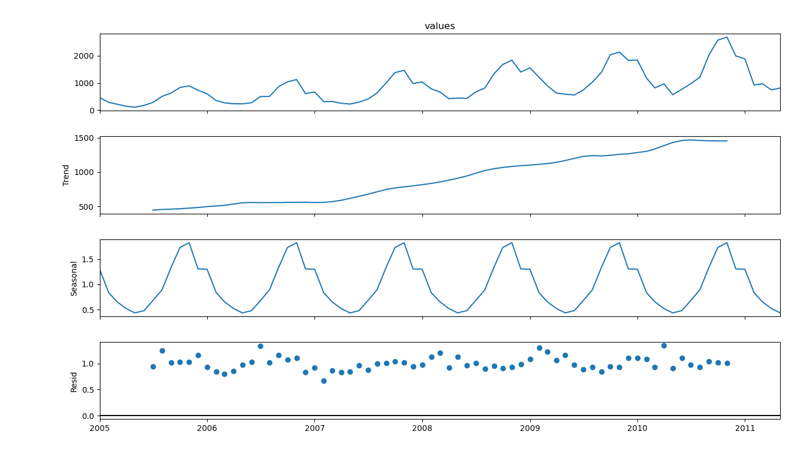
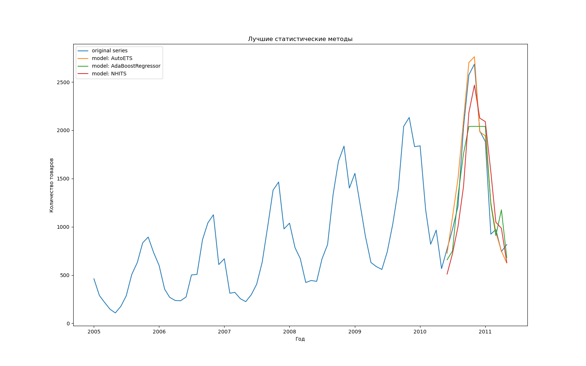

# TSHomeWork
## 1. Цель и постановка задачи

Цель исследования - выявление наиболее подходящего метода прогнозирования для исследуемого временного ряда.

Для анализа был выбран временной ряд с количеством проданных товаров одной компании по месяцам (находится в файле: sales_init.csv).

Постановка задачи: в ходе работы необходимо выполнить выбор наиболее точного метода прогнозирования одномерного временного ряда на последний год с использованием метрик MAPE и RMSE.

## 2. Обоснование выбора методов

| Группа | Модель | Обоснование |
|---|---|---|
| Статистические методы | Naive | модель базового уровня для статистических методов и других методов |
| Статистические методы | SeasonalNaive | улучшение базовой модели для учета сезонности |
| Статистические методы | AutoARIMA | часто применяемый метод, который дает хорошие показатели|
| Статистические методы | AutoETS | хорошо предсказывает тренд и сезонность |
| Статистические методы | AutoTheta | для сопоставления с AutoETS |
| ML | SVR | базовый уровень в группе ML |
| ML | RandomForestRegressor | хорошо работает с нелинейными связями |
| ML | AdaBoostRegressor | для сопоставления с RandomForestRegressor |
| DL | DLinear | базовый уровень в группе DL |
| DL | NHITS | эффективная DL модель для разных видов прогнозирования |
| DL | LSTM | хорошо работает с последовательностями |

## 3. Задача 1 - EDA и подготовка данных

В ходе выполнения EDA была выполнена начальная подготовка данных, а также анализ пропусков в них и их корректность. После были исследованы основные характеристики ряда и выполнено его разложение.



Из графика виден возрастающий тренд, а также сильная сезонность. Также заметно, что разница минимального и максимального значений целевой перменной за сезон также растет с течением времени.

Также было проведено исследование стационарности с помощью критерия ADF, в котором за нулевую гипотезу принимается, что ряд не стационарен, и тогда при значении p_value большим 0.05 она принмается, если меньше то отвергается. Полученное значение равно 0.98, следовательно ряд не является стационарным.

Вывод по задаче 1: при анализе исследуемого ряда были выявлены его характеристики: выраженная сезонность, восходящий тренд, временной шаг в месяц и отсутствие стационарности. Отсутствие стационарности было выявлено по ранее описанным свойствам ряда, а также формализованным методом с помощью теста ADF.

## 4. Задача 2 - Применение статистических моделей

Определим 5 статистических моделей для прогнозирования: Naive,  SeasonalNaive,  AutoETS, AutoTheta и AutoARIMA.

Полученные метрики
| Модель | RMSE | MAPE |
|---|---:|---:|
| Naive | 1133.90 | 52% |
| SeasonalNaive | 336.26 | 21% |
| AutoARIMA | 289.89 | 17% |
| AutoETS | 151.58 | 9% |
| AutoTheta | 187.00 | 12% |

Вывод по 2 задаче: из полученных метрик видно, что лучший результат по обоим метрикам пренадлежит AutoETS (MAPE=10% и RMSE=151) для исследуемого временного ряда. Модель AutoTheta показала близкий результат, проиграв на 2% по метрике MAPE и на 36 единиц по RMSE. На третьем месте находится модель AutoARIMA (MAPE=17% и RMSE=289), проигрывая лидеру больше, чем в 1.5 раза, чуть худшее качество демонстрирует SeasonalNaive (MAPE=21% и RMSE=336), проигрывая лидеру уже больше, чем в 2 раза. Naive показывает самый плохой результат, проигрывая лидеру в 5 раз. Поэтому с остальными результатами моделей других групп будет сравниваться результат AutoETS. Также сильная разница между Naive и SeasonalNaive - на 31% по MAPE и в 3 раза по RMSE, показывает, что учет сезонности повышает качество предсказаний для данного ряда.

## 5. Задача 3 - Применение DL и ML моделей

### В работе используются слудющие 3 ML модели для прогнозирования: SVR,  RandomForestRegressor и AdaBoostRegressor.

Полученные метрики
| Модель | RMSE | MAPE |
|---|---:|---:|
| SVR | 838.74 | 33% |
| RandomForestRegressor | 348.00 | 21% |
| AdaBoostRegressor | 313.64 | 19% |


Вывод по ML моделям 3 задачи: из полученных метрик видно, что лучшей по обоим метрикам является AdaBoostRegressor (MAPE=19% и RMSE=313). Близкой по качеству, но немного проигрывающей, оказывается RandomForestRegressor, проигрывая 2.5% по MAPE. Самой плохой оказалась модель SVR (MAPE=33% и RMSE=838), проигрывая на 14% по MAPE лидеру, и оказываясь больше лидера по RMSE в два раза.Таким образом лучшей моделью в данной группе оказывается AdaBoostRegressor.

### Также в работе используются слудющие 3 DL модели для прогнозирования: NHITS, LSTM и DLinear.

Полученные метрики
| Модель | RMSE | MAPE |
|---|---:|---:|
| DLinear | 1766.09 | 102% |
| NHITS | 331.96 | 23% |
| LSTM | 395.48 | 25% |


Вывод по DL моделям 3 задачи: DLinear показала самый худший резльтат в данной группе моделей а также среди вообще всех моделей (MAPE=102% RMSE=1740). NHITS (MAPE=23% RMSE=331) и LSTM (MAPE=25% RMSE=395) показывают похожие результаты, но NHITS лучше на 2% по MAPE и на 64 единицы по RMSE. Таким образом, в данной группе лучшей моделью выбрана NHITS.

## 6. Данные по лучшим моделям

Метрики лучших моделей при прогнозировании временного ряда на следующий год.

| Группа | Лучшая модель | RMSE | MAPE |
|---|---|---:|---:|
| Статистические методы | AutoETS | 151.58 | 10% |
| ML | AdaBoostRegressor | 313.65 | 19% |
| DL | NHITS | 331.96 | 23% |

Анализ метрик: из представленных результатов видно, что AutoETS является лучшей моделью для прогнозирования значений данного ряда, хуже ее на 9% по MAPE и в 2 раза по RMSE является AdaBoostRegressor, а хуже модели AdaBoostRegressor на 4% по MAPE и немного по RMSE является модель NHITS.

Также для подтверждения, что лучшей моделью является AutoETS ниже представлена визуализация предсказания на 1 год значений ряда для всех трех лучших моделей, и значения реального ряда.


## 7. Задача 4 - Работа пайплайна

В ходе работе был сформирован pipeline, реализующий разбиение переданных данных строго по границе времени и без перемешиваний, он после чего передает разбиение для обучения и тестирования полученным моделям, после на основе результатов моделей pipeline считает метрики качества и в конце, он также считает время работы всего пайплайна.

### Код пайплайна
```
# получение statsforecast frame из series
def get_statsforecast_frame(series_name, data):
    return pd.DataFrame({"unique_id": series_name, "ds": data.index, "y": data.values})

# получение названий столбцов с результатми предсказаний
def get_data_columns_name(frame_pred):
    return frame_pred.columns.tolist()[2:]

# правильное разбиение временного ряда на тренировочную и тестовую выборки
def time_series_split(series_tmp):
    split_idx = int(len(series_tmp) * 0.85)
    train_series = series_tmp.iloc[:split_idx]
    test_series = series_tmp.iloc[split_idx:]
    return {
        'train_series_base': train_series,
        'test_series_base': test_series
    }

# получение разбияния выборки в формате tatsforecast frame
def get_statsforecast_frame_train_test(series_name, data):
    result_tmp = time_series_split(data)
    return {
        'train_statsforecast_frame': get_statsforecast_frame(series_name, result_tmp['train_series_base']),
        'test_statsforecast_frame': get_statsforecast_frame(series_name, result_tmp['test_series_base']),
    }

#получение метрик для полученных предсказаний
def calculate_metrics(y_pred, y_true):
    dct_metrics_tmp = {
        'MAPE': mean_absolute_percentage_error(y_true, y_pred),
        'RMSE': root_mean_squared_error(y_true, y_pred)
    }
    return dct_metrics_tmp

# получение итоговой таблциы с метриками для одного вида моделей
def get_table_metric_by_models(test_df, calculated_df, model_names):
    local_test_data = test_df['y']
    local_calc_df = calculated_df[model_names]
    result_list_metric = []
    for model_tmp in model_names:
        result_metrics = {}
        metrics_calc = calculate_metrics(local_calc_df[model_tmp].values, local_test_data.values)
        result_metrics['MAPE'] = metrics_calc['MAPE']
        result_metrics['RMSE'] = metrics_calc['RMSE']
        result_metrics['Model'] = model_tmp
        result_list_metric.append(result_metrics)
    return pd.DataFrame(result_list_metric)

#Функция запуска работы пайплайна
def run_pipeline(data_series, group_models, name_ts="ts_data"):
    #начало отсчета времени работы пайплайна
    start_work_pipeline = time.time()
    
    # разбиение исходного ряда на train и test
    dct_train_test_local = get_statsforecast_frame_train_test(name_ts, data_series)
    train_local = dct_train_test_local['train_statsforecast_frame']
    test_local = dct_train_test_local['test_statsforecast_frame']
    
    #определяем горизонт прогнозирования, как длину тестовой выборки
    length_test_local = len(test_local)
    
    #получение результатов работы группы алгоритмов
    result_pipe_local = group_models.forecast(df=train_local, h=length_test_local)
    
    #получение метрик алгоритмов
    metric_local = get_table_metric_by_models(test_local, result_pipe_local, get_data_columns_name(result_pipe_local))
    
    # сохранение метрик
    show_metric = get_table_metric_by_models(test_local, result_pipe_local, get_data_columns_name(result_pipe_local))
    
    
    #измерение и отображение времени работы пайплайна
    end_work_pipeline = time.time()
    execution_time_work_pipeline = end_work_pipeline - start_work_pipeline
    print(f"Время выполнения: {execution_time_work_pipeline} секунд")

    return {
        'metrics': show_metric
    } 
```
В коде пайплайна за его работу отвечает функция run_pipeline, которая использует другие вспомогательные функции представленные в коде пайплайна. Пайплайн был протестирован в работе для моделей Naive,  SeasonalNaive и AutoETS, и он корректно отработал.

## 8. Итоговый вывод

В ходе работы были выявлены характеристики исследуемого ряда. После анализа представленного ряда и его обработки в ходе данной работы были применены различные методы прогнозирования временных рядов. Показанные результаты сравнивались по метрикам качества. Лучше всего для прогнозирования исследуемого ряда подходили методы статистической группы, среди которых лучшим оказался - AutoETS с метриками MAPE=10% и RMSE=151. После чего был сформирован пайплайн моделей и запущен. Пайплайн корректно отработал и продемонстрировал те же метрики для моделей, которые были отображены при анализе.
Таким образом, поставленная задача была выполнена.